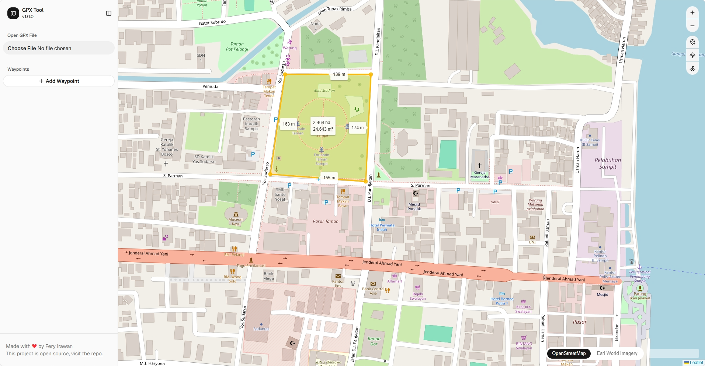

# GPX Tool

> A web-based utility for viewing GPX files, managing waypoints, and measuring land area — like MapSource, but on the web.

[](https://opensource.org/licenses/MIT)
[](https://reactjs.org/)
[](https://leafletjs.com/)

## Note:

### The code structure is not yet organized, and the current focus is on functionality.

## ✨ Features

- **Open GPX Files** — Load and visualize GPX tracks and waypoints on an interactive map
- **Waypoint Management** — View all waypoints in a sidebar for quick reference
- **Add Waypoints** — Add new waypoints interactively by clicking on the map or via form input
- **Polygon Measurement** — Create polygons from markers and calculate land area
- **UTM Coordinate Input** — Input coordinates in UTM format like MapSource
- **Export Polygon Measurement** _(coming soon)_ — Export polygon to pdf

## 🗺️ Demo



## 🛠️ Tech Stack

| Technology    | Purpose                    |
| ------------- | -------------------------- |
| React         | Frontend framework         |
| Leaflet       | Interactive mapping        |
| React-Leaflet | React bindings for Leaflet |
| (to be added) | UTM conversion library     |

## 📦 Installation

```bash
# Clone the repository
git clone https://github.com/ferys2195/gpx-tool

# Navigate to project directory
cd gpx-tool

# Install dependencies
npm install

# Start development server
npm run dev
```
